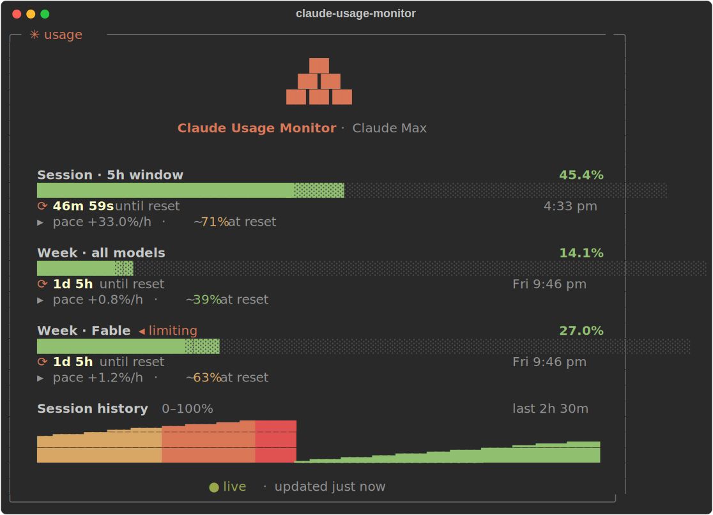

# Claude Usage Monitor

A live tmux-pane TUI for Claude Code usage limits — the 5-hour session window,
the weekly window, model-scoped weekly limits, and when each one resets. Styled
to match the Claude Code terminal theme so it looks at home next to your other
panes. Comes with `claude-account`, a subscription router that cycles Claude
Code across multiple claude.ai logins and shows each account's remaining
capacity at the bottom of the monitor.



## How it works

Two data sources, merged:

1. **Passive feed (primary).** Claude Code pipes a `rate_limits` object to
   every statusline refresh (~10s) in every session. `statusline-dispatch`
   snapshots it to `~/.claude/usage-feed/<session>.json`, and the monitor
   reads those files — so while any session is running, session/weekly
   numbers are seconds-fresh with **zero API calls**. Sessions can report
   slightly stale numbers, so the merge takes the newest reset instance and
   the max percent within it (usage is monotonic inside a window).
2. **API poll (supplement).** The monitor also polls the endpoint the
   `/usage` screen uses (`api.anthropic.com/api/oauth/usage`) with the OAuth
   token of the current Claude Code login (macOS Keychain item
   `Claude Code-credentials`, or `~/.claude/.credentials.json` on Linux) —
   for what the feed lacks: model-scoped weekly limits, the `◂ limiting`
   flag, severity, and usage credits. While the feed is fresh this poll
   relaxes to every 5 minutes, so it rarely gets rate-limited at all.

The token is only ever held in memory; it is never printed, logged, or written
anywhere. The feed files contain only percentages and reset times.

## Requirements

- [uv](https://docs.astral.sh/uv/) — Python dependencies resolve automatically
  from the script header
- A Claude Code login (`claude` → `/login`)
- `jq` and [ccstatusline](https://github.com/sirmalloc/ccstatusline) for the
  statusline lite mode

## Install

```sh
git clone https://github.com/jd-green/claude-usage-monitor.git
cd claude-usage-monitor
ln -sf "$(pwd)/claude-usage" ~/.local/bin/claude-usage
ln -sf "$(pwd)/statusline-toggle" ~/.local/bin/claude-statusline
ln -sf "$(pwd)/claude-account" ~/.local/bin/claude-account
```

For the statusline modes (optional), point the Claude Code statusline at the
dispatcher in `~/.claude/settings.json`:

```json
{
  "statusLine": {
    "type": "command",
    "command": "/absolute/path/to/claude-usage-monitor/statusline-dispatch",
    "padding": 0,
    "refreshInterval": 10
  }
}
```

## Run it

```sh
claude-usage
```

That's the whole command — it launches the monitor with the lite statusline
(see below) and works from any directory, including tmux:

```sh
tmux split-window -h claude-usage
```

Direct invocation without the wrapper:

```sh
uv run monitor.py
```

## Options

| Flag | Default | What it does |
| --- | --- | --- |
| `--interval N` | 60 | Poll interval in seconds (min 30) |
| `--once` | — | Fetch once, print the raw JSON payload, exit |
| `--notify` | — | Send a notification (macOS + tmux message) on threshold crossings (80%/95%), window resets, and `◂ limiting` changes |
| `--autorotate` | — | When the live login hits 100%, switch to a saved account confirmed to have headroom (needs ≥ 2 slots — see *Multiple accounts*) |
| `--lite-statusline` | — | Switch the statusline to lite (context info only, no usage polling) while the monitor runs; restored on exit |
| `--mute-statusline` | — | Hide the Claude Code statusline entirely while the monitor runs; restored on exit |

`CLAUDE_MONITOR_INTERVAL` sets the default interval via the environment.

## What the display means

- **Session · 5h window** — the rolling 5-hour usage window, with reset
  countdown and local reset time.
- **Week · all models** — the weekly window across all models.
- **Week · [model]** — a model-scoped weekly limit (e.g. Fable/Opus) when your
  plan has one. The `◂ limiting` tag marks the limit Anthropic currently
  considers the active constraint.
- **▸ pace** — burn rate over the last 45 minutes, plus a projection: either
  `~64% at reset` (you'll clear it) or `hits 100% ~3:40 pm, before reset`
  (you won't). Appears once a few minutes of samples accumulate; measurement
  restarts automatically after a window reset.
- **Session history** — a 3-row chart of the *current* 5h window, reset
  boundary to reset boundary: it fills left to right as the window
  progresses, clears at each reset, and the header shows the window's
  bounds. Height is a fixed 0–100% scale colored by utilization; dots mark
  elapsed time with no data (monitor wasn't running), blank space is the
  window's remainder. History persists across restarts
  (`~/.claude/usage-monitor-history.json`).
- **Accounts** — one row per saved login (see *Multiple accounts*): `●` marks
  the live one, each row shows that account's window percentages, and a
  session at ≥90% shows its reset countdown. Non-live rows also show usage
  credits when enabled — `$X left` when the account has a spend cap or prepaid
  balance, otherwise `$X used` (uncapped pay-as-you-go accounts, and orgs that
  meter the cap centrally, report no per-member cap). Appears once a second
  account is saved.
- **Extra usage credits** — when credits are enabled but your plan still has
  headroom, a compact line shows credit spend to date (and available/today
  when known).
- **Drawing on usage credits** — once plan quota is exhausted (the window
  Anthropic flags as limiting is pinned at 100% — or every known window, when
  nothing is flagged) and usage spills onto credits, the bars are replaced by
  today's credit spend, big and centred, with total spend-to-date and the
  reset countdown for when plan quota (and free usage) returns. Today's
  figure counts from the first sample the monitor sees each day, per login
  (a switch restarts it), and persists across restarts
  (`~/.claude/usage-monitor-credits.json`).
- Bar colors shift green → yellow → orange → red as utilization climbs (and
  follow the API's severity flag when it escalates).

## Notifications

With `--notify` (included in the `claude-usage` wrapper by default), the
monitor sends a macOS notification and flashes a tmux status message — but
only on state *transitions*, never repeatedly:

- a window crosses 80% or 95% (upward),
- a window resets,
- the `◂ limiting` tag moves to a different window.

Remove `--notify` from the `claude-usage` wrapper if you'd rather it stay
quiet.

## Multiple accounts

If you run more than one claude.ai subscription, `claude-account` turns the
single Claude Code login into a rotation:

```sh
claude-account save            # snapshot the current login (name = email local part)
# now `claude` → /login with the second account, then:
claude-account save
claude-account next            # rotate to the next saved login
claude-account switch spare    # or jump to one by name
claude-account list            # ● active, ○ ready, token state
claude-account remove spare    # delete a slot (the account itself is untouched)
```

How a switch works: Claude Code keeps its OAuth tokens in the Keychain item
`Claude Code-credentials` (macOS) or `~/.claude/.credentials.json` (Linux),
and the account identity (`oauthAccount`, `userID`) in `~/.claude.json`.
`switch` swaps both to the target slot's copies — and only those: MCP server
logins stored in the same keychain blob and the rest of `~/.claude.json` are
preserved. Before swapping, the live login's tokens are folded back into its
own slot, so refresh-token rotation done by Claude Code is never lost. If a
slot's access token has expired, it's refreshed against the same OAuth
endpoint the CLI uses (and the rotated tokens are persisted).

Two things to know:

- **New sessions get the new login at once; running sessions follow at their
  next retry.** A running session holds its tokens in memory, but Claude Code
  re-reads the credential store when a request retries — so a session blocked
  on a rate limit resumes on the new login without a restart. The switch also
  clears the passive usage feed so leftover statusline snapshots from
  old-login sessions don't bleed into the monitor.
- **Slot storage is Keychain-native on macOS** (service
  `claude-usage-monitor.account`, one item per slot). On Linux, slots are
  `0600` files under `~/.claude/usage-monitor-accounts/`. The index file
  (`~/.claude/usage-monitor-accounts.json`) holds names and emails only —
  tokens are never printed, logged, or written outside the keychain/slot
  files. One deliberate exception: refresh tokens are single-use, so if a
  keychain write fails right after a token refresh, the new tokens are kept
  in a `0600` rescue file next to the slots (and folded back into the
  keychain on the next successful write) rather than lost.

### Accounts in the monitor

With two or more slots saved, the monitor grows an **Accounts** section at
the bottom — spare capacity at a glance, so you know whether another
subscription has headroom before you hit a wall:

```
Accounts  ·  usage per login
● james    5h 47%           wk 32%  fable 27%                   live
○ spare    5h 91% ⟳42m 10s  wk 12%  fable 9%   $21.50 left    3m ago
```

The `●` live row mirrors the main panel's merged numbers. Every other slot is
polled on its own token every 5 minutes (each account has its own rate-limit
budget on the usage endpoint, so this doesn't compete with the main poll),
with stale tokens auto-refreshed. Columns align across rows and drop from the
right when the pane is narrow; a session window at ≥90% shows its reset
countdown inline, and non-live rows show credit headroom (`$X left` / `$X
used`) when usage credits are enabled. Cells with no data show `—`, and rows
fall back to `rate limited` / `needs /login` / `waiting…` — missing numbers
are never guessed.

When the live login changes outside the monitor — a `claude-account switch`
in another terminal, or a manual `/login` — the panel notices (within one
20s tick), drops everything it knew about the previous login rather than
showing it under the new account's name, renders `—` placeholders, and
re-polls the new login immediately.

### Auto-rotate

Add `--autorotate` and the monitor acts on that information instead of just
showing it: when the live login's fullest window reaches 100%, it tries the
saved logins with the most known headroom first and switches to the first one
a fresh poll confirms has room — so blocked sessions resume on the new
account at their next retry (see *Multiple accounts* above). The Accounts
header gains a `⟳ auto-rotate` tag and the panel notes each switch:

```
⟳ 14:02 auto-rotated to spare — previous login hit 100%
```

It's deliberately paranoid about flapping: switches respect a 2-minute
cooldown, only numbers fetched after the previous switch count, and the live
login's 100% is itself re-confirmed against the API before any switch — so a
stale snapshot (say, from a window that just reset) never triggers one. If
every saved login is maxed, the note says so and the monitor waits for the
earliest reset.

## Statusline modes

`statusline-dispatch` picks a mode based on flag files, so every Claude Code
session switches together (within ~10s, one statusline refresh):

- **full** (default) — ccstatusline exactly as configured, including the
  usage-limit widgets that poll the rate-limited API from every session.
- **lite** — the same ccstatusline, minus the network widgets (`reset-timer`,
  `weekly-usage`, `weekly-reset-timer`). Model, context window, tokens, and
  cost all stay, and are computed locally — zero API calls. Implemented by
  running ccstatusline with `HOME` pointed at a shadow home
  (`~/.claude/ccstatusline-lite/`) whose config is auto-generated from the
  real one, so theme/layout edits carry over.
- **native** — a minimal one-liner (model, context used/size/%, session cost)
  rendered directly from the JSON Claude Code pipes in — no npx startup, no
  transcript parsing, zero network.
- **off** — nothing.

In every mode, the dispatcher also writes the passive usage feed the monitor
reads (see *How it works*).

Note: neither full nor lite mode sandboxes ccstatusline — it runs unpinned
(`npx -y ccstatusline@latest`) with access to your real `~/.claude` and
`~/.cache` (lite's shadow `HOME` exists to swap the config, not to isolate).
If that bothers you, `native` mode has no third-party dependency at all.

```sh
claude-statusline lite     # ccstatusline without usage polling
claude-statusline native   # minimal, zero-dependency line
claude-statusline full     # everything back
claude-statusline off      # blank
claude-statusline status   # check
```

Or let the monitor drive it: `claude-usage` passes `--lite-statusline` by
default (you keep per-session context, the monitor is the only thing polling
usage); `claude-usage --mute-statusline` hides the statusline entirely. Both
restore the previous state on exit, and leave the flag alone if you had
already set it manually. If the monitor dies to SIGKILL a flag can linger —
`claude-statusline full` clears it.

## Rate limiting

The usage endpoint is aggressively rate-limited, and in full statusline mode
every running Claude Code session polls it too. The passive feed makes this
mostly moot: session and weekly numbers keep streaming regardless, the footer
shows both source ages (`● live · feed 6s ago · api 3m ago`), and the API
poll relaxes to every 5 minutes while the feed is fresh. When the API does
429, the monitor backs off (honoring `Retry-After` when present, otherwise
30s → 300s exponential) with a live countdown, and only the scoped-limit /
`◂ limiting` details go briefly stale. Running the statusline in lite mode removes the
per-session polling entirely, which makes the monitor's own refreshes far more
reliable.

## Testing

```sh
uv run --python 3.12 --with pytest --with "rich>=13.7" pytest tests/ -q
sh tests/test_dispatch.sh
```

The pytest suite covers the parsing (limits and credit spend), merge, pace,
event, sparkline, and persistence logic, the credits views and auto-rotate
flow, plus footer rendering states, and the account router's slot store,
switching, rotation, and token-refresh flows — no network or Keychain access
(the accounts tests run against the file backend in a tmp dir with stubbed
HTTP). The shell suite runs `statusline-dispatch` in an isolated `HOME`
with a stubbed `npx`, asserting mode selection, feed writing, and the
run-ccstatusline-exactly-once invariant. Both run in CI on every push.

## Files

| File | Purpose |
| --- | --- |
| `monitor.py` | The TUI itself (single-file, PEP 723 inline deps) |
| `accounts.py` | Account router — slot store, login switching, token refresh (stdlib only) |
| `claude-usage` | Launcher wrapper — `uv run monitor.py --lite-statusline` from anywhere |
| `claude-account` | CLI wrapper for `accounts.py` — save/list/switch/next/remove/status |
| `statusline-dispatch` | Statusline entrypoint for `~/.claude/settings.json`; picks full/lite/off |
| `statusline-toggle` | Flips the mode flag files (installed as `claude-statusline`) |

## License

[MIT](LICENSE). Not affiliated with or endorsed by Anthropic; "Claude" and
"Claude Code" are Anthropic trademarks, used here only to describe
compatibility.
